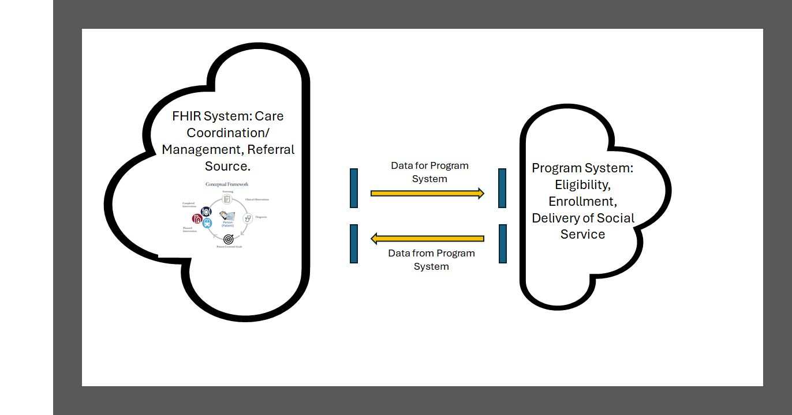

# The Approach
The work product is a Companion Guide (Guide) to the Gravity Project’s SDOH Clinical Care 2.1 Implementation Guide. 
* Use cases were developed by Subject Matter Experts from Social Services Domains and identified requirements for enhancements to FHIR.
* An implementation approach (SDOH CC Approach) was developed based on the SDOH Clinical Care 2.1 Implementation Guide.
* An SS DAM was developed to provide an alternative implementation approach (SS DAM Approach). 
* Using the above two approaches, the Implementation Guideline was developed leveraging the functional benefits provided by the SDOH CC Approach and the SS DAM Approach.
# Other Design Considerations
**Complementing the SDOH CC IG:** To integrate and complement the SDOH CC IG, this guide scope contains the following two actors. To integrate and complement the SDOH CC IG, this guide scope contains the following two actors.
1. FHIR System – A FHIR system in this Guide is a software system that is compliant with the HL7 FHIR Standard. The FHIR System provides a Whole Person Care (WPC) view. A WPC view enables any member of the care team, with appropriate authorization, to view an individual’s record that includes information across clinical, behavioral, and social domains. This record includes the ability to capture an individual’s care support team and their associations with other individuals and social groups such as family, household, religious and spiritual,  and social and work organizations. The FHIR system provides care coordination and care management functional capabilities and can interact with other systems that deliver social services.
2. Program System – A Program System in this Guide is a software system that accepts referrals from the FHIR System that can address social risks and fulfill social domain goals. Given a referral, the Program System will determine eligibility for the individual or a group the individuals (e.g., family or household) for a program, enroll the participants in the program, and specify who will receive the service, what the service is, when the service(s) are utilized, and other quantifiable properties. This data is provided to the FHIR System that was the source of the referral.

Figure 1 shows how show the interaction between the two actors and its relationship to the SDOH CC IG.  

> Figure 1: Enhancement to SDOH CC IG  
Note: This figure needs a graphics person. The figure comes from the Gravity / Cervitas SOCIAL CARE CO-DESIGN FINAL REPORT.

The system depicted on the left is a FHIR System that provides Whole Person Care for all participants in the system of care. It can be represented in the SDOH CC IG as the FHIR system that sends information about the referral to a Program System. The Program System depicted on the right may or may not be a FHIR-based system. The assumption has been made that it is not an FHIR-based system. To support this assumption, in the United States, over $400 billion of Social Services were delivered by just 3 separate Federal agencies in 2022 using non-FHIR systems to address housing insecurity, food insecurity, and temporary financial security.  

**Data  Payload Requirements:** The flow of the data (Payload) between these two systems has been driven by the Use Cases developed for the Project. Subject matter experts have reviewed what is useful to the FHIR System and Program System. 
## Out-of-Scope: ##
To deliver a solution for providing WPC in an operational environment is a complex endeavor. This Guide does not address other necessary functional requirements.  

**Implementation of Workflow:** This Guide does not attempt to define an implementation approach for exchanging data between the FHIR-based system and the Agency System. Several patterns are available and analysis and recommendations will be deferred to a later publication.   

**Capability for FHIR System to identify specific Social Services Program:** Some FHIR systems can identify the appropriate specific program to address the specific social need or risk. This specific version of the Companion Guide assumes that the Agency System will determine the appropriate social service program based on its eligibility rules. Future versions may include the scope where computable eligibility requirements may be available to the FHIR system and recommendations for specific social services may be recommended.

**Eligibility for a Social Services Program:** Although of great benefit for an FHIR system would be if a particular individual or group of individuals are eligible for a Social Service, this will be considered in future Use Cases. Having such capability for the FHIR system to do this could increase the efficiency for all parties.  

**Privacy Policies:** It is assumed that data can flow freely and unencumbered between the FHIR System and the Program System as the implementation of Privacy Policies is out of scope. However, consideration of Privacy Policies will need to be considered in the future.

**Insert Michelle’s work here**  

 
